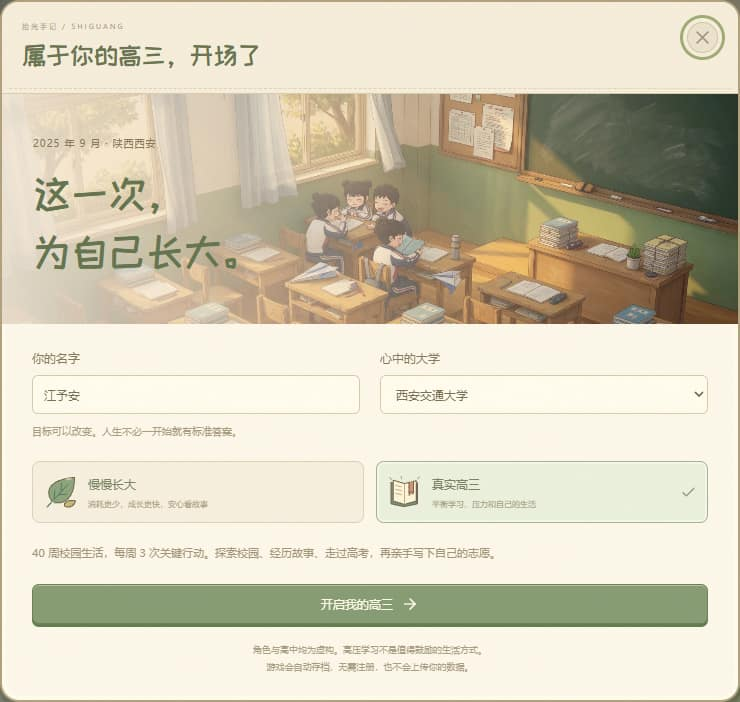
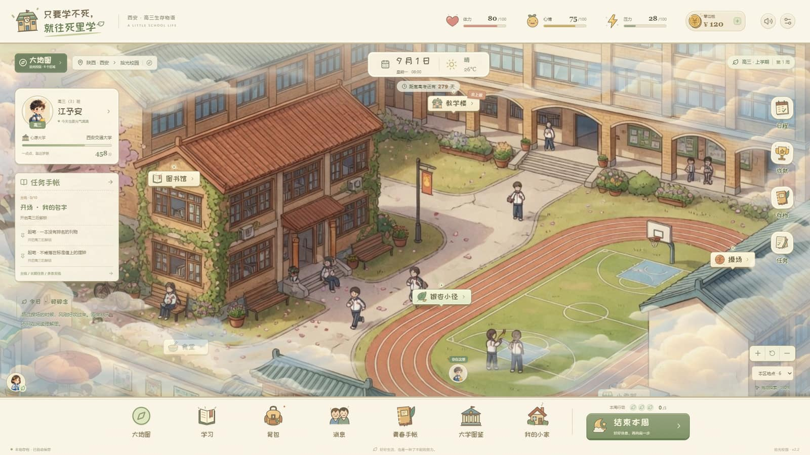
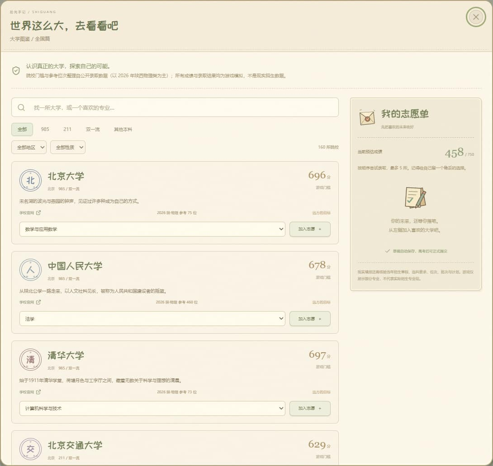
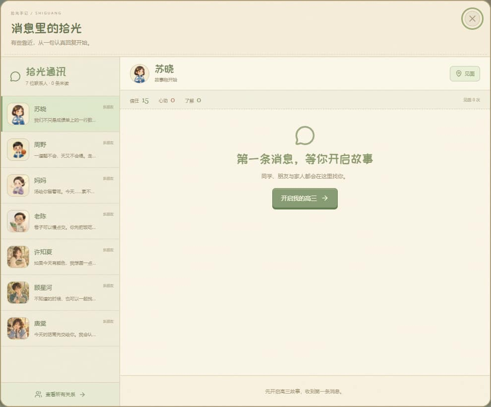
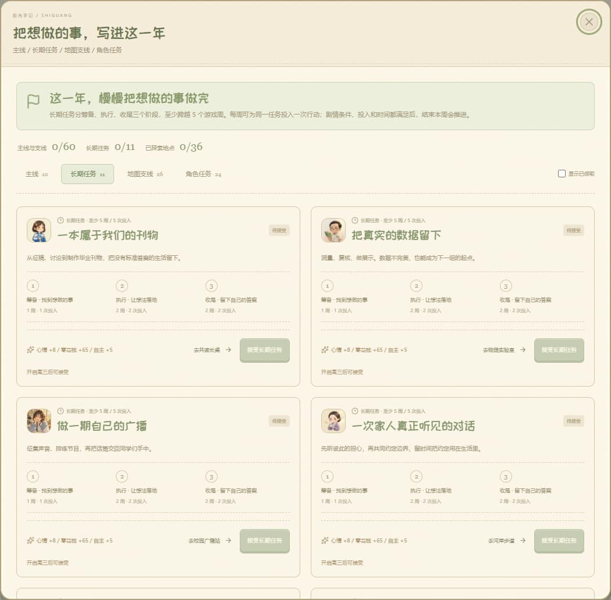
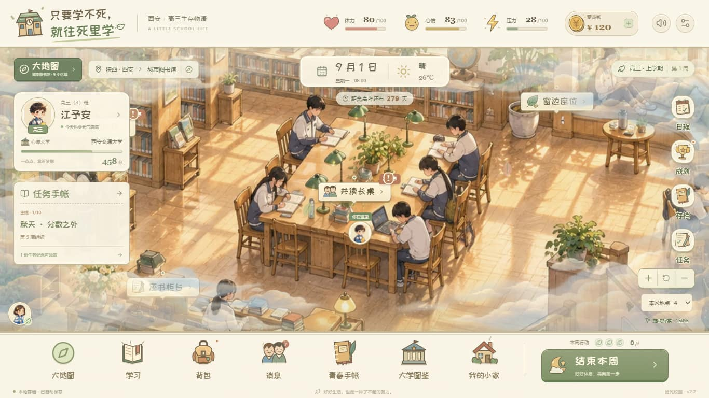
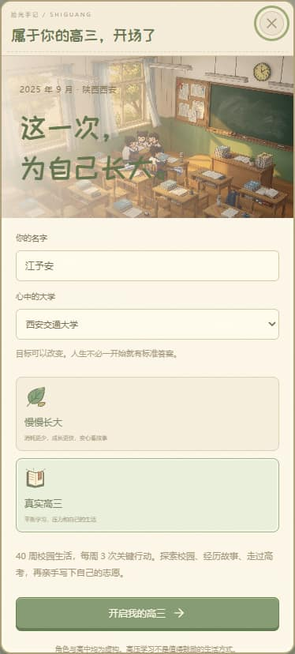
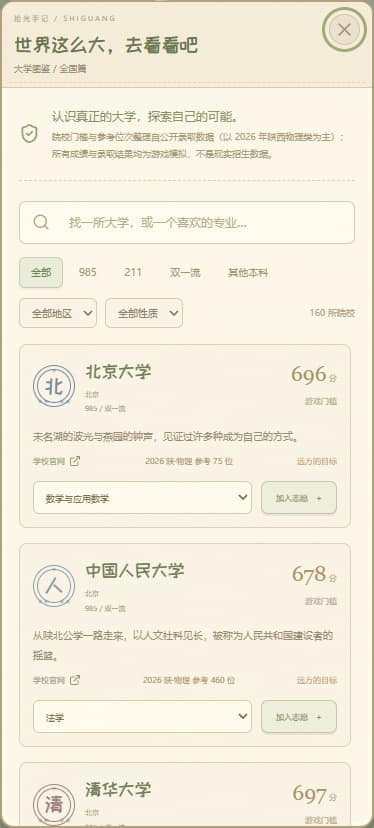
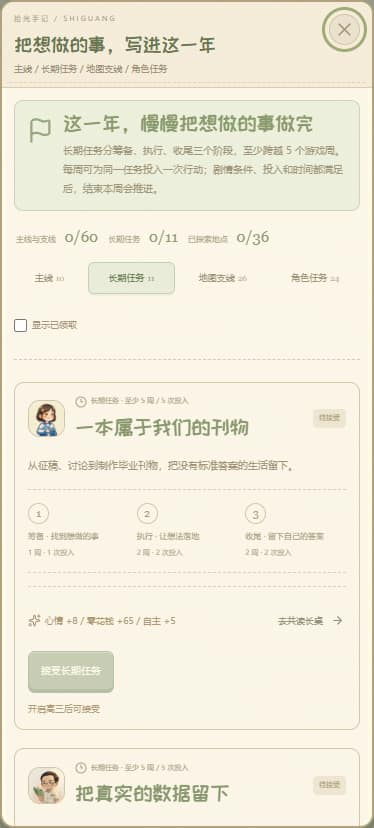
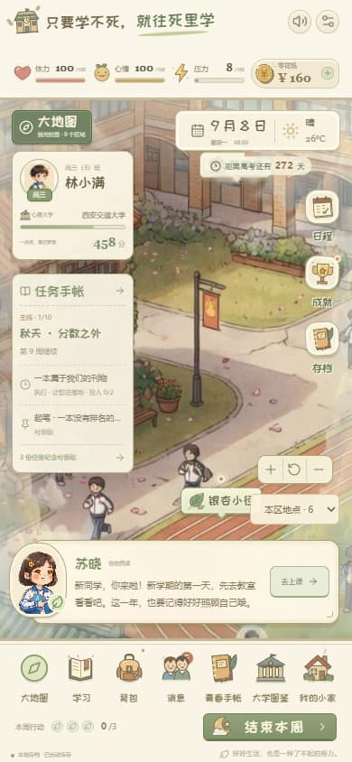

# 只要学不死，就往死里学

《只要学不死，就往死里学》（拾光校园）是一款以西安虚构高中为背景的本地单人模拟养成游戏。React 19、Vite、Tailwind CSS v4、Motion 和 Web Audio API 驱动，不需要后端、账号或付费 API。

- 在线试玩（GitHub Pages，免费）：[b5-software.github.io/zhiyaoxuebusi](https://b5-software.github.io/zhiyaoxuebusi/)
- Cloudflare Pages：[zhiyaoxuebusi.pages.dev](https://zhiyaoxuebusi.pages.dev/) · [shiguang-campus-life.pages.dev](https://shiguang-campus-life.pages.dev/)

当前版本 **v3.0.0**：高中、大学与社会三张大地图，11 张独立生成且保留原始分辨率的小地图，以及工作、资产交易、健康病程、婚姻育儿、持续年龄与世代继承。详见 [发布记录](docs/release-v3.0.md)。

## 游戏画面

| 开局：属于你的高三 | 校园：和苏晓一起长大 |
| --- | --- |
|  |  |

| 大学图鉴：288 所院校 | 消息：和重要的人保持联系 |
| --- | --- |
|  |  |

| 任务手帐：长期主义 | 世界地图：云层上的校园 |
| --- | --- |
|  |  |

| 移动端：开局 | 移动端：大学图鉴 | 移动端：任务手帐 | 移动端：世界地图 |
| --- | --- | --- | --- |
|  |  |  |  |

## 内容

- 毕业后持续人生：11 个新区域、5 种交互小游戏、8 类岗位、8 项人生长任务。大学至少 208 周与 160 学分取得本科；工作工资、医疗与保险、家庭照护、模拟交易和身体病程统一按周推进。死亡后可结算或继续孩子的人生。
- 40 个浓缩游戏周，每周 3 次关键行动，完整衔接高考、志愿投档与多条件毕业叙事。
- 138 段原创分支事件，其中 48 段地点故事包含 6 条连续支线、街区日常和生日庆祝。每段地点故事消耗 1 次行动，行动用完后地图标记隐藏。另有 10 段专属约见剧情，IM 邀请会跨周保留，地点页点击“赴约”消耗 1 次行动。已读事件不会重复抽取，随机池也会尽量错开相同人物和场景。
- 9 个可拖拽和缩放的小地图、36 处互动地点：校园、小家、古城、图书馆、实验楼、社团、公园、夜市、大学。支持触屏单指拖动、双指围绕指间中心缩放，默认 150%。常驻大地图入口可直接选择区域，小地图另有地点列表，边缘渐隐到有体积感的云层。任务地点显示感叹号，屏幕外地点显示可点击定位的箭头；大地图也提示有任务的区域。
- 本地生成场景、角色、恋爱及透明云层图、24 种原创 SVG 图标。
- 六科学力、体力、心情、压力、健康、自主、金钱、7 位角色关系、40 种行动与物品。
- 持久任务手帐：10 章主线、26 项地图与探索支线、24 项角色任务，以及 16 个真正跨周推进的长期任务（含五条至少六周的恋爱专属任务）。长期任务分筹备、执行、收尾，至少需要 5 个不同游戏周、5 次行动投入，满足剧情或相处条件后在周末推进；六条地点项目还需等待后续章节与春季结局。任务支持追踪、地点跳转与一次性奖励。
- 内置仿 IM 通讯界面：未读提示、联系人、聊天记录、58 组原创来信与可选回复。全部 5 位攻略对象及家人、老师都能主动联系；33 个专属主动话题之外，每位联系人在 40 周内都有当周日常话题。每人每周主动联系一次，主动消息和回复均不消耗行动。
- 5 位虚构成年角色可攻略：可主动表白、约会、牵手、拥抱、轻吻、邀请回家、跨地图跟随、冷静、分手与重新交往。专属心事界面有 30 段跨周剧情、回忆、边界、手工纪念册与学校 / 家人关注。详见 [v2.7.0 恋爱系统发布记录](docs/romance-v2.7.md)。
- 首次进入单独确认玩家年龄。未知或未成年玩家隐藏成人向特殊入口；成年玩家每次在私人剧情前确认 NSFW 提示，可无损跳过。私密叙事仅用非露骨转场。年龄偏好不随存档导入，刷新不保留本次剧情同意。
- 7 位角色及主角共有 8 段普通生日剧情；5 位恋人在交往时有各自的情侣生日变体。IM 提前提醒、日程显示生日与庆祝地点，生日周首份礼物的关系和心意加成 50%（取整向上），每人每年一次。完成庆祝后可邀请恋人回家，生日私人时光仍需本次成年确认与观看／跳过选择，两种选择的收益和消耗相同。高考后的生日会明确提前庆祝，保留真实日期。妈妈保留亲情路线。老陈在校保留师生交流，毕业一年后、管理关系结束才开放独立月度恋爱路线。
- 牵手、拥抱、轻吻插画分别在完成对应互动后点亮，尚未交往或尚未经历的片刻不会提前显示。苏晓头像展开与收起带动画，消息红点、地点故事与任务角标分别排列。
- 280+ 所大学图鉴：覆盖全国双一流、省属重点、特色强校、民办本科与中外合作院校，可按层次（985 / 211 / 双一流 / 其他本科）、地区与办学性质筛选并搜索；卡片显示 2026 年陕西物理类参考位次，可排序 5 个志愿并完成模拟录取。门槛与参考位次整理自公开投档数据（以 2026 年陕西物理类为主，部分院校使用 2025 位次换算），详见 `docs/university-data-2026.md`。
- v3 实时自动存档、最近 6 个恢复点、v1 / v2 自动迁移、3 个手动槽、经过校验的 JSON 导入导出、音量设置、减少动态效果、全屏。
- 本地打包字体、合成背景音乐和 6 种交互音效；生产环境提供离线资源缓存。
- 开局可输入自定义姓名，默认「江予安」；成长手册支持随时改名。头像、剧情、消息、考试结果、毕业通知及当前存档称呼同步更新，旧默认名自动迁移并保留进度。
- 手机、平板、桌面与短横屏自动适配：缩小地图上的信息卡，完整功能保留在导航和弹窗中；任务、消息等弹窗按可用空间重排并滚动。苏晓默认收成小头像，可展开对话或再次收起。

## 开发与部署

运行 `npm ci` 安装依赖，`npm run dev` 开发，`npm run build` 生成生产版本，`npm run preview` 本地预览生产版本。`npm run typecheck` 检查 TypeScript，`npm test` 验证跨周任务、地图支线、主动消息、恋爱、事件去重与存档。

Cloudflare Pages 两个项目为 `shiguang-campus-life` 和 `zhiyaoxuebusi`，生产分支均为 `main`。通过已登录的 Wrangler 执行 `npm run deploy:pages:both`，构建并上传 **整个 `dist/` 目录**；图片、清单与 `sw.js` 必须一同上传。无需环境变量。部署配置见 `wrangler.jsonc`，缓存及响应头见 `public/_headers`。

GitHub Pages：推送到 `main` 后由 `.github/workflows/deploy-pages.yml` 自动执行类型检查、测试与构建，并部署 `dist/`。构建使用相对资源路径（`base: './'`）与作用域感知的 Service Worker，同一份产物可同时工作在域名根路径和仓库子路径。

启动时先显示约 4 KB 的 HTML 加载页与约 12 KB 的压缩模糊校园背景，绘制完成后再请求游戏模块、样式和字体；程序加载失败时提供重试。进入游戏后 Service Worker 以两路低优先级请求逐步缓存地图、人物与其他字体，完整缓存前保留旧版资源。`cache-manifest.json` 随构建输出全部程序资源清单。离线模式需要 HTTPS 或 localhost，且首次在线加载后等待后台缓存完成；域名根路径和 GitHub 仓库子路径均经过断网刷新验证。外部大学官网链接仍需联网。更新版本时应同步修改 `public/sw.js` 中的缓存版本。

## 许可

- 代码：GNU GPL-3.0-or-later，见 [`LICENSE`](LICENSE)
- 美术、文档与游戏文字等资源：CC BY-NC-SA 4.0，见 [`LICENSE-ASSETS.md`](LICENSE-ASSETS.md)

## 存档

自动存档键为 `shiguang-school-save-v2`，滚动恢复点为 `shiguang-school-auto-backups-v2`。行动、事件选择、聊天记录、主动消息、关系变化、任务追踪及长期任务的阶段和投入记录实时保存。旧版 v1 / v2 会迁移至 v3，保留恋爱与任务进度，新版同时保存当前地图、角色相处周次、跟随、来访和回忆。玩家年龄独立存储在 `shiguang-audience-v1`，不随存档导入。旧版 v2 缺少的新字段会自动补齐，任务不会在周末重置。主档损坏时尝试读取最近的有效恢复点；存档面板也可以手动恢复。

旧的 `shiguang-school-save-v1` 会自动迁移，保留原始旧档。手动槽仍为 `shiguang-school-slots-v1`，设置仍为 `shiguang-school-settings-v1`，旧的手动档和 JSON 导入也兼容。存档不上传服务器。隐私模式、浏览器清理及存储配额会影响本地保存，建议在菜单中导出备份。

## 信息边界

人物、高中与剧情为虚构。大学简介来自各学校官方公开页面；院校门槛与参考位次整理自公开投档数据（以 2026 年陕西物理类普通本科批为主，部分院校因数据缺失使用 2025 年位次换算），来源与方法记录在 `docs/university-data-2026.md` 与 `docs/university-data-2026.json`。所有分数门槛与录取规则均为游戏设计参数，不能用于真实志愿填报。

游戏采用语数英及物化生的简化学科模型，不完整复刻任何年度实际考试或招生政策。现实决策请核对当年招生章程、选科要求、位次、批次及计划。

## 验证范围

111 项逻辑测试覆盖长期任务推进与行动消耗、地图项目、全联系人主动消息、主支线奖励、五条恋爱路线、表白与分手、成年确认、普通与情侣生日、礼物加成与冷却、消息与事件去重、旧档迁移、恢复点、自定义姓名、150% 默认缩放、双指缩放焦点与范围、任务标记及边缘定位。类型检查与生产构建通过。

浏览器检查覆盖大地图／小地图切换、云层、地点故事、长期任务接受与投入、跨周推进、主动消息及刷新后的记录恢复；零花钱加号居中。`scripts/check-responsive.mjs` 在 10 种视口（320×568 至 1920×1080，含短横屏）逐一检查 13 类面板、导航、苏晓收放和地图控制，记录见 `docs/responsive-checks.json`。v2.4.0 的约见与行动消耗检查覆盖 5 种桌面、手机及短横屏视口，左右边距对齐、赴约与地点故事扣行动、行动耗尽后的大小地图标记隐藏均已验证，记录见 `docs/meeting-checks.json`。游戏截图在 `docs/screenshots/`。

## 资源

原创生成游戏美术位于 `public/images/`。新增素材使用内置 `image_gen` 生成，完整提示词及输出文件见 `docs/generated-art.json`、`docs/generated-portraits.json` 与 `docs/generated-clouds.json`；游戏使用压缩 WebP，云层保留透明通道。图标在 `src/components/GameIcon.tsx`。ZCOOL KuaiLe 字体通过 Fontsource 本地打包，遵循 OFL-1.1；Lucide 图标与其开源许可一并保留在依赖中。所有游戏内声音由浏览器合成，不依赖外部音频服务。

游戏宣传海报见 `docs/poster/shiguang-poster.png`（1200×1800）。内置 `image_gen` 按游戏美术参考生成插画，原图、可编辑排版 HTML、真实二维码 SVG 均保留在 `docs/poster/`；提示词和资源清单见 `docs/generated-poster.json`。二维码使用 H 纠错等级与四模块留白，目标为 https://b5-software.github.io/zhiyaoxuebusi/，最终 PNG 经过二维码解码验证。

本轮 v2.7.0 新功能检查见 `docs/romance-browser-checks.json`；主动表白、来访、年龄入口、刷新重新确认覆盖五种视口，另有手机与桌面跟随、分手流程检查。

v2.8 系列的五种视口布局、真实双指手势、生日私人剧情确认与跳过记录见 `docs/ui-v2.8-checks.json`；加载重试与子路径离线验证见 `docs/loading-path-checks.json`。v2.8.2 的确认框居中检查见 `docs/warning-layout-checks.json`，圆形头像在动画中的逐帧检查见 `docs/avatar-layout-checks.json`，完整说明见 [v2.8 发布记录](docs/release-v2.8.md)。
