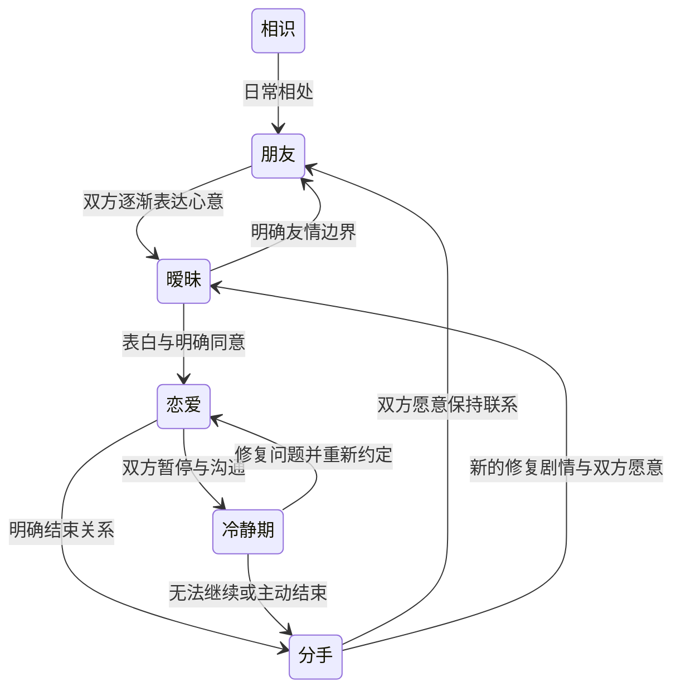

# 恋爱系统扩展方案

日期：2026-10-07。基线：v2.4.0。本文件保留最初设计。初始完整实现已进入 v2.7.0，实际功能与验证范围见 [romance-v2.7.md](romance-v2.7.md)，以发布记录为准。

用户追加设定：玩家与全部 5 位同龄攻略对象开局均已满 18 周岁；增加角色地图位置、恋人跟随、邀请回家和非露骨的私密相处。这是虚构角色的明确年龄设定，不以“高三”年级代替年龄验证。

用户追加显示要求：成人向片段前明确展示 NSFW 警告，由玩家选择进入或跳过；游戏中的成人向片段仍采用非露骨表达。

## 现状核查

| 功能 | 当前实现 | 需要补齐 |
| --- | --- | --- |
| 攻略对象 | 苏晓、周野、许知夏、顾星河、唐棠，共 5 位同龄角色 | 保留各自性格、选择和边界，避免共用换名字的路线 |
| 表白 | 对方通过 IM 发起；第 25 游戏周起，信任至少 60、心动至少 55，且完成前置消息 | 玩家主动表白、当面剧情、实际相处条件、拒绝和暂缓后的不同走向 |
| 暂缓表白 | 回复“需要一点时间”后，满足条件可以补答 | 单独的待回应状态和清晰入口，避免藏在礼物工具栏里 |
| 独占关系 | `social.partner` 与 `bond.route` 保存恋爱对象，限制同时确定多段关系 | 冷静、分手、前任和修复关系的完整状态转换 |
| 关系变量 | 信任、心动、了解、见面次数、每周礼物与见面记录 | 关系质量、近期情绪、边界、承诺、关系开始周次及历史 |
| 约见 | IM 邀请推导待赴约记录，跨周保留；赴约消耗一次行动 | 区分友情与恋爱、取消与改约、约会内容选择、失约与和好 |
| 约见剧情 | 10 个事件入口，每位角色的两种来源复用同一组正文和选择 | 将来源不同的见面写成不同的情节，区分初识、暧昧与恋爱 |
| 送礼 | 消耗背包物品，每人每周一次；偏好礼物收益不同 | 恋人专属礼物、手工制作、纪念物与具体剧情回应 |
| 恋爱界面 | 只有 IM 中的恋人标识和数值、关系卡片 | 常驻且容易发现的恋爱专属入口 |
| 恋爱后续 | 恋人消息、毕业寄语；现有角色长期任务可由友情完成 | 确定关系后的持续玩法与独立恋爱任务链 |
| 学校／家长关注 | 没有独立系统 | 可预见的关注、传闻、沟通与支持机制 |
| 地图人物 | 当前只有玩家的地图位置指示器，苏晓陪伴头像是另外一个固定 UI | 显示人物所在地点、角色日程、同行与恋人跟随 |
| 邀请回家 | 没有对应邀请、访客状态或家中相处流程 | 邀请与同意、回家路线、接待地点、家庭互动及适龄的私密相处 |

核查依据：`src/game/socialData.ts`、`social.ts`、`engine.ts`、`types.ts`、`appointments.ts`、`projects.ts`，以及 `Messenger.tsx`、`GamePanels.tsx`。当前表白的前置是“回复邀约”，并未检查完成赴约；这点需要修正。

## 设计范围与基本规则

- 本次核心范围是明确成年角色的校园恋爱：聊天、送礼、陪伴、牵手、拥抱、轻吻、约会、邀请回家、私密相处、冲突、分手、修复与毕业选择。
- 玩家与 5 位攻略对象增加明确年龄／生日，开局资料均显示“18 岁以上”，生日须早于或等于游戏开局日减 18 年。家长和教师保持非攻略联系人。当前没有年龄字段的旧档按这次明确的虚构设定补齐。
- 私人时光采用双方成年、明确愿意后的非露骨私密相处：确认场景后淡出，回到普通相处与收尾。不描写私密细节，不制作裸露或露骨插画；任何年龄未确认或未满 18 岁的新增角色，均不得进入此分支。
- 成人向片段必须先展示 NSFW 内容提示，不自动播放、不默认选中继续。进入与跳过都有完整收尾，跳过不影响关系进度、任务、奖励或已付行动。
- 所有亲密互动都基于双方愿意。已确认恋爱关系不等于永久同意任何互动；拒绝可以自然结束，尊重边界不扣信任。
- 维持每周 3 次行动。整场约会含故事与选择，只结算一次行动；进入地图、打开界面、看旧回忆和回复 IM 不扣行动。
- 普通聊天和正常交友不能被系统自动判成恋爱。家庭／学校关注是剧情压力，不是善恶评分。
- 不要求每天打卡维持恋爱，不以连续送礼代替理解，也不因普通忙碌永久损失关系。
- 所有开场、聊天、回忆、分手和毕业文本继续使用自定义玩家名字。

## 恋爱专属界面

入口名建议为“心事”，与现有手帐、水彩、纸张和鼠尾草绿风格一致。

1. 关系面板每张攻略卡增加“心事与关系”按钮，相识阶段即可查看进度。
2. IM 顶部增加清楚的“心事”入口；确定关系后显示“我们的故事”。
3. 确定关系后，主界面增加一张可收起的小卡：恋人头像、称呼、近期心情、下次约定。保持小尺寸，不覆盖地图，不再扩大底部导航数量。
4. 没有恋人时，显示心动对象与各自进展；有恋人时默认打开当前关系。前任回忆在独立历史区查看。

界面使用四个页签：

| 页签 | 展示与操作 |
| --- | --- |
| 我们 | 对方头像、确定关系日期、一起度过的周数、近期心情、信任／心动／了解与关系质量描述 |
| 相处 | 聊天、约会、一起走走、送礼、牵手／拥抱／轻吻、邀请回家、私密相处、关心、沟通、冷静或分手；显示行动成本与解锁提示 |
| 约定 | 待赴约、改约、共同长期任务、最近的承诺与纪念日 |
| 回忆 | 按时间排列表白、重要约会、共同作品、赠礼、冲突和毕业选择；已读剧情可免费回看 |

学校与家长的关注状态放在“约定”或主卡的次级提示中，显示“平静／被注意／需要沟通”及原因。常驻界面不堆十几根进度条。

响应式要求：窄屏单列、页签可横向滚动、长内容在模态框内部滚动；小窗口也能找到返回和关闭按钮。标题、卡片、列表与操作区共用左右内边距。主卡可折叠成头像。约会地点沿用现有地图感叹号与屏幕边缘指引；行动耗尽后继续隐藏全部地图任务标记。

## 表白与关系转换

### 玩家主动表白

保留对方主动表白，新增玩家主动发起，两者共用关系状态和剧情条件。

初始建议门槛（需要游玩调参，不作为无法修改的最终数值）：信任 60、心动 55、了解 30；完成至少两次发生在不同游戏周的实际见面；完成该角色的一段心事剧情。让正常投入的路线大致在第 9—12 周可进入表白机会，不再一律等到第 25 周。

UI 列出还缺哪些经历，例如“再一起度过一个下午”或“对方还有一件想告诉你的事”。达到条件出现明确提示，也可以提前表达，获得温和拒绝或“再了解一下”的回应。

当面表白按一次行动结算。可选择场景与表达方式，但不会通过购买昂贵礼物保证成功。玩家先看见对方的反应，再做确认，不直接把数值门槛变成自动配对。

双方选择：愿意、先想想、保持朋友。暂缓有独立待回应入口；明确拒绝不靠重复点击刷成功。同一人物的再次表达须经过新剧情和间隔，且对方仍愿意继续了解。

### 状态机

冷静期仍占用当前恋人状态；明确分手才释放。分手至少提供“保持朋友”和“暂时少联系”，让对方表达自己的选择。保留聊天与回忆，取消或归档尚未完成的恋爱约会，停止情侣专属来信和新任务推进；已完成任务、已获得纪念物及可领取奖励继续保留。

不自动清空信任，也不把前任立即变成陌生人。复合需要新的修复经历和双方同意，设置冷却期；必须处理现有恋人冲突，不能绕过单一恋人约束。关系列表应正确显示前任、朋友和冷静状态。

## 恋爱操作与行动结算

| 操作 | 初始规则 | 反馈与约束 |
| --- | --- | --- |
| 回复／主动 IM | 不扣行动，沿用每人每周一次主动话题上限 | 恋人有专属关心、报平安、分享与约定；避免反复刷数值 |
| 一场约会 | 1 次行动 | 包含到达、相处内容、亲密选择与收尾；失败的邀请不先扣赴约行动 |
| 一起走走／同行 | 开始相处时 1 次行动，作为已有约会的一部分时不重复扣 | 激活地图跟随，不因拖地图、切区域或移动头像重复结算；路过的独立地点故事仍需另扣一次行动 |
| 当面表白 | 1 次行动 | 包含对方回应；不能在本周行动耗尽后触发 |
| 普通赠礼 | 消耗物品，每人每周一次，不额外扣行动 | 显示偏好、反应和本周记录；重复礼物不重复解锁剧情 |
| 制作纪念礼物 | 材料与跨周制作投入 | 接入长期任务；制作和赠送的花费分别标清 |
| 牵手／拥抱／轻吻 | 可作为约会中的选择，不重复扣行动 | 检查关系阶段、对方边界与当下状态；拒绝后不强制继续 |
| 邀请回家 | 邀请／回复免费，实际家中相处 1 次行动 | 可接受、改天或拒绝；不因“已经同行”跳过邀请确认 |
| 私密相处 | 作为已结算约会／家访中的选择，不重复扣 | 仅明确成年角色、双方当下明确愿意、场景合适；淡出表现，不以此购买好感、解锁强制进度或获得额外刷取奖励 |
| 陪伴／谈心／道歉 | 单独见面时 1 次行动 | 解决具体问题，不能用一次道歉清空所有未处理冲突 |
| 冷静／分手 | 在关系界面明确确认，可通过 IM 表达，不消耗行动 | 不因行动不足阻止玩家结束关系；不额外扣钱或扣物品 |
| 读旧回忆／浏览界面 | 免费 | 不重新发奖励、不更改关系状态或增加关注度 |

约会的地点、故事、礼物和亲密选择均有独立记录。不得“进入地点扣一次、赴约再扣一次、收好故事又扣一次”。邀请、选择地点是筹备，真正开始相处时统一结算。

“贴贴”表现为肩靠肩、牵手、短暂拥抱；日常亲热使用非露骨的轻吻。成年角色的私密相处另有明确同意与淡出流程。角色不同，接受方式不同；不因数值达标默认同意，不因拒绝私密相处惩罚关系。

## 地图人物、日程与恋人跟随

### 人物位置

小地图显示玩家与当前区域内的 NPC，头像较地点牌小，名称按需展开。点击角色头像能查看“在这里做什么”、聊天、约见或相处入口，不直接消耗行动；进入相处才结算。

| 人物 | 默认活动地点 | 可变化的日程 |
| --- | --- | --- |
| 苏晓 | 教室、图书馆、共读长桌 | 上课、共读、放学后的散步 |
| 周野 | 操场、旧琴房 | 训练、排练、周末街头音乐 |
| 许知夏 | 阳光画室 | 美术社、河岸写生、作品整理 |
| 顾星河 | 实验室、屋顶观星台 | 实验、温室记录、放学观星 |
| 唐棠 | 广播站 | 录节目、采访、节目结束后的休息 |
| 妈妈 | 家中、日常街区 | 家庭相处与既有家人剧情 |
| 老陈 | 教学楼、实验楼 | 上课、课后答疑与谈话 |

日程根据游戏周、行动时段和当前剧情确定，不根据电脑真实时间随机跳动。已接受的约会覆盖普通日程，NPC 出现在约定地点；剧情完成、改约或取消后恢复日程。

同地点多人采用轻微错位或合并头像菜单；跟随角色只绘制一个地图实体，不能在默认地点再出现一个副本。地图移动、缩放与角色头像共用地图坐标，头像尺寸作反向缩放，防止 150% 视角下遮住地点牌。地图拖拽只改变视图，不改人物实际位置。

大地图提供“某某在此区域／与你同行”的小提示。“找恋人”按钮可定位当前区域与具体地点，角色位置无任务时不统一加红点。行动耗尽后隐藏任务标记，但普通人物头像和已在同行的恋人仍可看见；仍可查看聊天、结束同行或结束关系。

### 跟随流程

1. 恋爱界面、IM 或人物头像菜单发起“一起走走”，由对方同意；确定恋爱关系不自动开启全天跟随。
2. 同意并开始后建立一场相处活动，统一结算一次行动。已有约会中加入同行，共用本场活动，不再收费。
3. 使用现有玩家移动动画，恋人保持侧后方的小偏移，稍晚到达目标；静止时站在附近。边缘位置自动调整偏移，避免头像越界、互相重叠或挡住按钮。
4. 切换区域时一起到达入口，可进入河岸散步、共读、夜市等已约定的相处内容；角色有独立的同行短对白。
5. 点击结束同行、结束本场相处、结束本周、进入考试或发生分手时解散。尚未完成的活动恢复／收尾规则清楚，不能用反复解散和重开刷收益。
6. 正在同行时保存玩家区域、地点、活动 ID、对方与位置；刷新或读档恢复原区域及同行状态。下一周自动结束的状态同样保存，避免恋人跨周意外永久跟随。

右下角可收起的陪伴头像在同行时切换为同行角色，头像、姓名和专属对白同步变化；未同行时保留现有引导角色。NPC 图像、对白及世界中的位置由角色 ID 统一绑定。

## 邀请回家与私密相处

“邀请回家”是有回应、有场景、有收尾的一次约定：

1. 从恋爱界面／IM 邀请，告知想一起做什么。对方可答应、改天或拒绝；有独立的约定卡，不因后续聊天消失。
2. 新增家门口、客厅接待位置，接入现有家地图；先明确是访客，再提供做饭、一起学习、看电影、交换纪念物等内容。进入家地图本身不扣行动，开始本场相处扣一次。
3. 正在同行并不意味着已经接受回家邀请。切换到家地图时，若没有邀请同意，先停在入口，由双方决定是否继续；不能直接把对方带进私人房间。
4. 家中是否适合接待访客、家人态度、对方近期心情和公开关系的意愿影响对话。可以坦然介绍、先沟通来访安排或改约；家访不能被系统直接等同于性关系。
5. 在双方明确成年、已经建立关系、均明确愿意且本场合适的情况下，可以选择非露骨的私密相处。首先显示 NSFW 提示，让玩家选择进入或跳过；选择进入后画面淡出，随后用普通的收尾对话恢复。一方犹豫就停下或换成普通陪伴，任何阶段都可以撤回。
6. 家访结束安排告别或送到门口，结束访客与跟随状态；记录本场回忆。留宿如以后加入，另有明确访客同意与时间安排，不与私密相处自动绑定。

首批至少给 5 位攻略对象各一段不同的回家相处剧情，与各自兴趣连接：苏晓交换书页、周野分享音乐、知夏布置小画作、星河一起做简单观察、唐棠录一段普通声音日记。回家分支能选择保持普通陪伴，完整完成剧情，不以私密相处作为成功条件。

### NSFW 提示与跳过流程

提示标题：“NSFW · 成人向内容提示”。

提示正文建议：“接下来的片段涉及成年角色的私密相处，采用非露骨表达。所有参与角色均已满 18 周岁。你可以选择进入，或跳过本段；跳过不会影响剧情进度与奖励。”

并列按钮：“进入剧情”和“跳过 NSFW 剧情”。焦点默认放在“跳过”或提示标题，继续不自动选中；手机和短窗口中也必须看见两个选项。提示前不加载或展示成人向预览、播放声音或推进分支。

需要区分两种选择：角色在故事里不愿意／撤回，是具体的关系情节；玩家选择跳过 NSFW，是观看偏好，不能因此给角色写成被拒绝、扣关系值或触发冷战。

玩家跳过时，用中性的过渡直接进入双方已确认的普通收尾；仍可免费选择改成普通陪伴。任务完成与关系确认依靠成年角色之前的相互同意和既有约定，不以是否观看成人向片段作为条件。跳过不再扣行动，剧情和奖励只结算一次。

设置中增加“总是跳过成人向片段”选项，默认不开启自动进入。玩家开启自动跳过后，直接使用安全的普通过渡；关闭它也不会自动进入，仍须在各片段前选择。回忆列表用内容标记提示，重看也经过同样的入口；跳过后不自动弹出成人向缩略图或声音。

显示层可使用统一 `ContentWarningGate`；事件数据增加内容分级与普通收尾入口。NSFW 片段的进入／跳过／结束状态与本场活动一起保存：刷新停留在提示或安全恢复点，不自动进入，亦不重复扣行动、发奖励。所有私密相处内容保持非露骨，内容提示不改变这一范围。

## 每位角色的专属剧情与长任务

第一批目标是每人 6 段有独立正文与选择的关键场景，共 30 段，包含重写当前复用的约见；后续再扩至每人 12 段。公共事件不冒充每个角色各一段新剧情。

每条路线覆盖：第一次认真的邀约、互相心动、主动或被动表白、恋爱初期、一次具体冲突、一次修复或告别，以及毕业的选择。实际安排可以通过支线补足，不能只靠提高三个数值推进。

| 角色 | 恋爱主题 | 专属场景与分歧 | 长任务例子 |
| --- | --- | --- | --- |
| 苏晓 | 表达与各自的未来 | 共读批注、雨天返程、不同城市的大学选择；靠近也保留自己的愿望 | 两个人的未来书单：各自选书、交换批注、查目标城市、留下毕业留言 |
| 周野 | 玩笑后的认真 | 训练后的陪伴、演出排练、被玩笑带过的委屈；学会认真回应 | 一首写给彼此的歌：共同选曲、分周排练、讨论表达、完成小演出 |
| 许知夏 | 被看见与被尊重 | 两个人的速写、送出画作、公开作品时的犹豫；尊重她对公开关系的节奏 | 一册无须评分的速写：观察、交换、讨论、制作、赠送 |
| 顾星河 | 承诺与未知 | 屋顶观星、阴天改约、一次被遗忘的约定；允许未来没有唯一答案 | 毕业前的星图：观察、记录、查证、聊未来、共同补完 |
| 唐棠 | 被倾听与自己的声音 | 关闭话筒后的谈心、广播稿分歧、属于自己的时间；不要求她一直照顾别人 | 双人声音日记：互相采访、收集日常、分周整理、共同选择保留的片段 |

每条新增恋爱长任务至少跨 6—8 个游戏周，有 4—6 个阶段、多个实际行动和两次关键选择。只有 `dating` 状态可以新接受；冷静时暂停，分手后给出收尾、转为个人作品或共同告别分支。现有五条友情也能完成的项目继续保留，不突然改成恋爱锁定。

事件池按人物、关系阶段、场景、已发生故事、承诺和冲突筛选。重要场景只播放一次，连续两次尽量不选同类内容；常规约会用不同的短对话与相处内容变化。拒绝某种互动后，本次约会不重复推送它。

纪念日按游戏周计算，既定故事结束时再提醒，不在剧情中插入另一个强制弹窗。毕业仍可选择继续、保留空间、异地尝试或告别，不能默认只有分数低就分手这一种因果。

## 学校与家长关注

使用三个分开的维度：学校关注、家长关注、校园传闻；家长支持和老师支持沿用相应关系并结合已做过的沟通。

低关注出现同学打趣，中关注出现班主任谈话或家长询问，高关注出现需要认真处理的关系／家庭分歧。每次触发展示具体来源，例如“最近两次约会被同学注意到”，不能毫无征兆强制发现。

公开相处、校内规则相关选择、误会与时间安排会影响关注。普通 IM、友情聊天和浏览恋爱界面不自动上涨；正常学习、兑现时间约定、双方沟通和家庭支持能改变后续剧情。地点评估显示大致的“容易被注意／较安静”，不提供现实绕过监管的方法。

可选应对包括：共同决定是否公开、暂缓公开、调整相处时间、认真解释、争取信任、设立隐私边界、先解决两个人之间的意见。暂缓公开不等于对方永远必须保密；公开关系也不是更高好感的必选项。

教师和家长的反应具有区别：老陈可以先谈学习与休息，也可能提供沟通支持；妈妈的担忧、认可和边界通过已有关系和选择变化。处理结果影响压力、短期见面安排、家庭沟通和恋人情绪，不删除存档、不强制永久封锁路线，也不拿恋爱直接替代学科成绩。

频率限制建议：同类关注事件至少间隔 2 周，每周至多一个相关主要事件；随机结果进入存档，刷新不能重抽。年级里程碑优先，不覆盖正在进行的故事，关注事件进入队列。温和模式降低频率与压力影响。

## 数据、存档与代码结构

核心关系字段以一个关系状态为权威来源，避免 IM、恋爱界面和任务各自维护一份恋人状态。新增字段建议：

- 阶段与历史：关系阶段、开始周、结束周、关系批次、历史对象、待回应表白、冷却截止周。
- 年龄与场景条件：玩家及人物的明确生日／成年状态、当前访客、家访约定、当次同意与撤回；年龄条件必须由规则层校验，不能只由按钮显隐限制。
- 体验变量：关系质量、近期心情、角色对公开关系与亲密互动的偏好；保留信任、心动和了解。
- 世界与同行：当前区域与地点、玩家位置、NPC 日程覆盖、同行对象、活动 ID、开始周次、是否已结算行动、访客状态。普通日程可推导，实际约定和正在进行的同行需保存。
- 约定：约会对象与地点、来源、接受／待赴约／改约／完成／取消状态、约定周、兑现情况。
- 内容进度：已读专属故事、恋爱任务阶段、共同纪念物、互动与礼物的周记录。
- 内容偏好与恢复点：总是跳过成人向片段、当前内容提示状态、进入／跳过选择、统一收尾与结算标志；观看偏好与角色关系选择分开存储。
- 外部关注：学校关注、家长关注、传闻、已解释的事件、待处理队列、支持与冷却。

重要约定不能继续只依靠最后一条消息，必须使用明确的记录；当前推导出来的旧约见迁移为新约定。可重复的日常互动记录与只读一次的故事收藏分开，复合不能碰撞旧表白消息 ID，也不能把旧奖励再领一次。

建议代码边界：

| 文件／区域 | 责任 |
| --- | --- |
| `game/romance.ts` | 表白、状态转换、同意／拒绝、冷静、分手与复合的统一规则 |
| `game/romanceData.ts` | 人物独立故事、偏好、事件条件与结果 |
| `game/romanceTasks.ts` | 跨周恋爱任务与不同收尾 |
| `game/social.ts`、`socialData.ts` | IM 接入恋爱状态，保留既有通讯功能 |
| `game/appointments.ts` | 明确约定记录、改约／取消、赴约与一次结算 |
| `game/characterSchedule.ts` | NPC 在游戏周与行动时段中的地点及约定覆盖 |
| `game/companions.ts` | 同行活动、跟随、切换区域、家访入口与收尾规则 |
| `game/relationshipPressure.ts` | 学校、家长、传闻事件与排队、冷却 |
| `components/RomancePanel.tsx` | 心事／我们的故事界面 |
| `components/PartnerCard.tsx` | 可收起的主界面恋人卡片 |
| `components/CharacterMapMarkers.tsx` | 地图角色头像、多人物布局、跟随与定位 |
| `components/HomeVisitPanel.tsx` | 家访内容、来访确认、淡出与收尾 |
| `components/ContentWarningGate.tsx` | NSFW 提示、明确进入／跳过、设置偏好与安全恢复点 |
| `engine.ts`、`types.ts` | 行动结算、存档与统一模型接入 |

产品版本建议先 v2.5.0，存档格式升级为 v3，自动兼容 v1/v2。迁移前保留旧备份：旧恋人直接保持恋爱，不强迫重新表白；旧信任、心动、了解、名字、成绩、任务和聊天全部保留；缺失的新历史不虚构成已经完成的约会。结束阶段的旧档保留可回看体验，不开启不符合阶段的校园行动。

新增插画仍遵循现有画风；第一批每人至少一张明确非性化的表白／约会图，角色身份与原头像一致，人物资料明确成年。家访插画表现日常陪伴，私密相处使用淡出，均不绘制露骨内容。先完成规则与界面验证，再扩图；地图与模态框图片压缩并适配屏幕。此计划不引入后端账号、在线多人聊天或跨站存档同步。

## 交付顺序与验收

| 阶段 | 交付内容 | 验收重点 |
| --- | --- | --- |
| A，v2.5.0 | 明确成年资料、存档迁移与关系状态机；心事界面和入口；主动表白、待回应；约会、亲密选择、赠礼；地图人物与基本恋人跟随；冷静、分手；30 段独立场景中的核心内容逐条配齐 | 5 人都能从相识进入恋爱或友情；实际赴约是表白的有效条件；每次相处只扣一次；跟随在缩放、切图与读档后正确；分手处理旧约定和同行；旧档不丢进度 |
| B，v2.6.0 | 5 条恋爱长期任务；邀请回家、访客状态与非露骨的私密相处；NSFW 提示与跳过；学校／家长关注、传闻、解释与支持；扩充人物分歧和修复 | 家访有明确邀请与同意，年龄限制在规则层生效；提示之前不播放，跳过有完整收尾且不损失进度；不重复扣行动；任务跨周；关注事件可理解、有冷却，不覆盖既有剧情；温和模式有效 |
| C，v2.7.0 | 每人扩至约 12 段重要场景；纪念物与纪念日；复合与毕业分支；补齐更多约会插画 | 已读重要剧情不重复；前任与新恋人状态不冲突；多种结局完整；内容风格与人物一致 |

大学篇属于独立的后续扩展，不作为 A/B/C 交付的前提；当前角色按用户追加设定明确成年，邀请回家纳入这轮计划。

必须验证的边界：

1. 未表白、邀请未回复、邀请被拒绝、同意后未赴约、已赴约等状态分别正确；不能靠一条邀请消息跳过实际相处。
2. 同一表白、行动、礼物、奖励与分手记录不能被双击或刷新应用两次；数据扣费与状态改变必须原子完成。
3. 满行动不能赴约或进入新地点故事；冷静／分手仍可表达；地图继续不显示可行动标记。
4. 约会内牵手／拥抱／轻吻不重复扣行动；对方拒绝后本场不重复请求；尊重拒绝不扣信任。
5. 已有恋人不能确定另一个对象；冷静期、明确分手和复合各自遵守唯一关系约束。
6. 分手后停发旧情侣消息，正确归档未完成恋爱约定；友情内容和既有收藏仍可使用。
7. 五条路线都能完成，告白暂缓、友情、分手、复合与毕业结局各有覆盖；内容不只是角色名替换。
8. 旧存档自动迁移，损坏数据可从备份恢复；在恋爱、冷静、分手和待赴约时刷新，都能恢复正确状态。
9. 学校／家长事件不连发、不覆盖眼前剧情；关注度的改变有具体解释，刷新不会重新掷骰。
10. 至少覆盖 320×568、390×844、768×600、1280×900、844×390；入口、操作和关闭按钮可达，左右边距一致，无横向溢出；截图可供复核。
11. 人物默认地点、约定地点与跟随状态一致；拖拽只移动视图；缩放不挡住地点；跟随角色没有第二个地图副本；前往家中不会绕过邀请同意。
12. 结束同行、结束本周、考试与分手都能正确收尾；读取途中存档恢复正确区域、人物及活动，行动不重复收费。
13. 年龄未知／未成年数据不能进入私密相处分支；成年角色仍需当次明确同意，犹豫或撤回立即转入普通相处，且不扣信任。
14. 邀请回家与私密相处分别可接受或拒绝，普通家访也有完整故事；家访收尾清理访客，不自动绑定留宿，不刷取关系或奖励。
15. 每个成人向片段在进入和回忆重看前显示 NSFW 提示；默认不进入；开启总是跳过时不播放任何片段预览、声音或缩略图。
16. 进入、跳过、取消、途中刷新和读档均可正确恢复；进入与跳过不改变任务、奖励和行动结算；观看偏好不被误解为角色拒绝或分手。

每个阶段完成后再递增实际版本号、更新离线缓存，运行逻辑与浏览器流程检查，提交并部署到现有两个 Cloudflare Pages 项目。当前阶段只产出这份计划。
